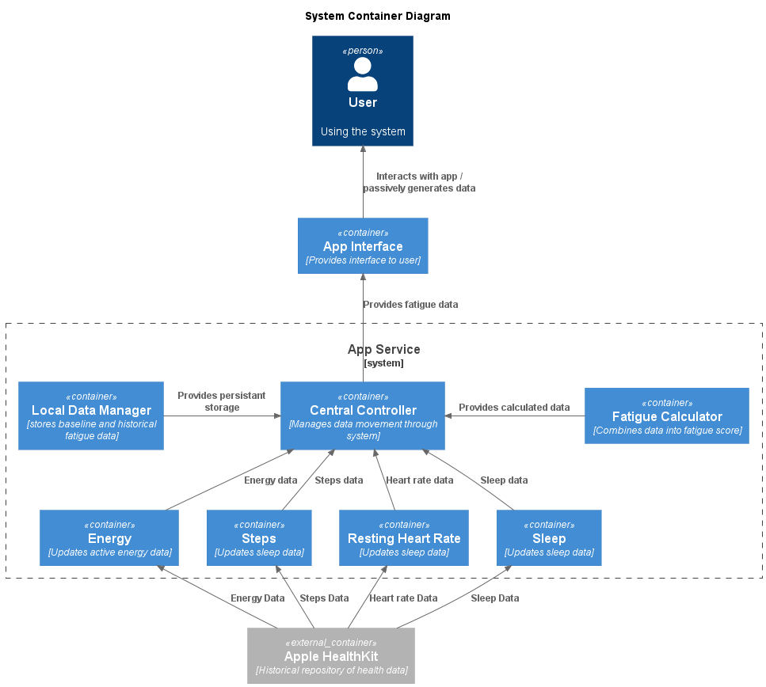
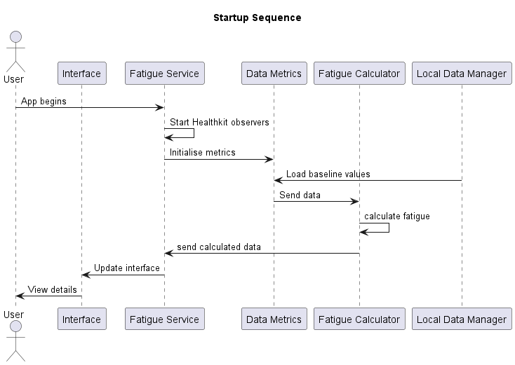
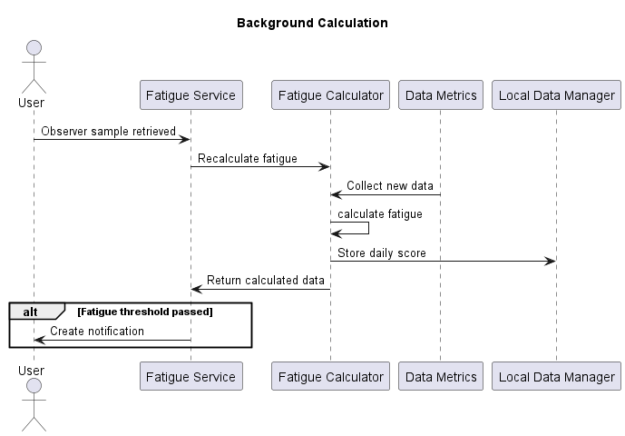

# Fatigue Risk Management System – watchOS App for Motorola Solutions
## Project Introduction
Our project is to create a smartwatch based application that leverages health tracking on the Apple Watch to calculate fatigue based on factors like sleep quality, heart rate and activity throughout the day. It will then notify the user if their fatigue level increases past a defined threshold, providing a warning for them to take a break. These factors have been implemented in a modular fashion, allowing for scalability if other risk factors are identified after our creation of this proof of concept.

### Core Features
- **SwiftUI Interface:** The app provides a simplistic interface presenting the user's current fatigue, and collected data used to calculate the score.  
- **Reactive Detection:** The system will passively scan the user's vitals and other provided information, determining whether they are reaching a dangerous level of stress and fatigue. 
- **Storage of Data:** Results of expensive calculations, such as determining user baselines, will be stored locally to prevent unnecessary recalculations.

### App Infrastructure
Our app infrastructure revolves around a central service class, that manages the flow of data between the interface, data providers, and local storage.
  

During app startup, the service passes the active metrics to the fatigue calculator, which contains them in a dictionary. Each metric conforms to a defined protocol, that specifies the methods and attributes for its class. This allows the calculator to treat each metric as a generic type, ensuring consistency and flexibility across different data sources. Instead, this process can occur once a day, when the watch is charging or when the user is inactive. 
  
The app service also manages staging background tasks, completed using Healthkit Observer queries (figure 3). When an observer query returns a result, it will initiate a recalculation. If the score is above a set threshold, it will trigger a notification to be displayed to the user. When the app is opened, the UI will reflect the new data collected.
  

### Fatigue Calculator
Provided the defined calculator follows the correct protocol, different classes can be introduced to define new ways to determine the final fatigue score. Currently, the default method uses the following process:
- Get total of all weights of metrics
- Get total of all metric weighted scores
- Divide total weighted score by total weights
- Clamp between 0 and 100

## Adding Metrics
Each new metric is required to follow the defined Metric protocol. The protocol specifies the required attributes for each metric:
- Metric name
- Defined weight (set in class initialisation)
- Raw Value (the raw data, for example heart rate in bpm)
- Baseline (either the user's standard result or the expected average)
It also specifies a few methods each metric must define. This could be metric-specific, heart-rate may be normalised differently compared to total number of steps.
- normalisedValue -> Double: Normalised value in a range of 0-1
- calculateBaseline: How each metric may determine the baseline value. This can include updating locally stored data.
Each metric has a default method to get the weighted score, using the normalised value:  
``normalisedValue() * weight``

If added metrics require certain permissions from the user (location, health access) either add the sample type to existing authorization requests, or define a new one. This should then be called during the start method.  
Current metrics are initialised in the HealthKit authorization method. This ensures the necessary authorizations are granted before the metrics are added.
Additional metrics should be added either in the service start method, or within defined authorization request method, which are then called in the start method.

## Testing on Xcode
To test the application on XCode, there must be a Watch simulator that is linked to an iPhone. This can be completed when creating a new watch simulator. This will allow for additions to health data that will update in the watch app. Due to issues with Xcode, it may take some time for updates to show on the watch. Restarting the Watch simulator may also help refresh the data.

## User Guide
Using the current solution is straightforward. The first time the app is started on an Apple Watch device, it will request the required Health data permissions from the user. Once accepted, the main screen will load, and will display the user's fatigue score, along with the details from the defined metrics.  
The start method of the app initialises several Healthkit observers, that will react to any updates provided for each respective metric. When activated, it will begin the fatigue recalculation process, and provide a notification if the score exceeds 80. The timing of this can be inconsistent. During testing, notifications appeared as frequently as every 10 minutes or as rarely as once per hour. This seems to depend on how active the user is being, however due to limited Apple documentation there are no specifics on when these functions will trigger.
